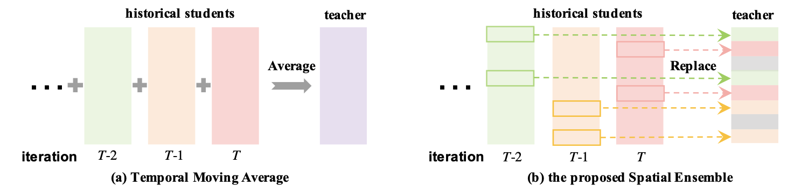

# Spatial Ensemble

Code for the paper Spatial Ensemble: a Novel Model Smoothing Mechanism for Student-Teacher Framework in NeurIPS 2021. The paper is available [here](https://proceedings.neurips.cc/paper/2021/file/8597a6cfa74defcbde3047c891d78f90-Paper.pdf).



# Requirements
1. All experiments are done with python3.6, torch==1.7.1; torchvision==0.8.2


# Usage
## Data Preparation
Prepare the ImageNet data in `${root_of_your_clone}/data/imagenet_train`, `${root_of_your_clone}/data/imagenet_val`.
Since we have an internal platform(storage) to read imagenet, I have not tried the local mode. 
You may need to do some modification in `spatial_ensemble/data/dataset.py` to support the local mode.

## Training

Before training, ensure the path (namely `${root_of_clone}`) is added in your PYTHONPATH, e.g.

```
export PYTHONPATH=$PYTHONPATH:${root_of_clone}
```

To do unsupervised pre-training of a ResNet-50 model on ImageNet in an 8-gpu machine, run:

1. using `-d` to specify gpu_id for training, e.g., `-d 0-7`
2. using `-b` to specify batch_size, e.g., `-b 256`
3. using `--experiment-name` to specify the output folder, and the training log & models will be dumped to './outputs/${experiment-name}'
4. using `-f` to specify the description file of ur experiment.

e.g., 
```
python3 spatial_ensemble/tools/train.py -b 256 -d 0-7 --experiment-name your_exp -f spatial_ensemble/exps/sts/exp_8_2080ti/sts_teacher_200e_exp.py
```


## Linear Evaluation:

With a pre-trained model, to train a supervised linear classifier on frozen features/weights in an 8 gpus machine, run:

1. using `-d` to specify gpu_id for training, e.g., `-d 0-7`
2. using `-b` to specify batch_size, e.g., `-b 256`
3. using `--experiment-name` to specify the folder for saving pre-training models.
```
python3 spatial_ensemble/tools/eval.py -b 256 --experiment-name your_exp -f spatial_ensemble/exps/sts/linear_eval_exp_byol.py
```


# Results

## Results of Pretraining on a Single Machine

After pretraining on 8 NVIDIA 2080 GPUS and 256 batch-sizes, the results of linear-evaluation are:

|         pre-train code                                                          |pre-train</br> epochs| top1/top5 accuracy | wights |
|---------------------------------------------------------------------------------|---------------------| ------------------ | ------ |
|[path](spatial_ensemble/exps/sts/exp_8_2080ti/sts_200e_32batch_1mm_099_exp.py)   | 200                 |  72.7/ 90.9        |  [link](https://drive.google.com/drive/folders/1_B72bSpj43lBI-4ruLLFpSQZBp4CQTSQ?usp=sharing)    |
|[path](spatial_ensemble/exps/sts/exp_8_2080ti/sts_300e_32batch_1mm_099_exp.py)   | 300                 |  73.0/ 91.3        |  [link](https://drive.google.com/drive/folders/1_B72bSpj43lBI-4ruLLFpSQZBp4CQTSQ?usp=sharing)     |
|[path](spatial_ensemble/exps/sts/exp_8_2080ti/sts_1000e_32batch_1mm_099_exp.py)  | 1000                |  74.5/ 91.8        |  [link](https://drive.google.com/drive/folders/1_B72bSpj43lBI-4ruLLFpSQZBp4CQTSQ?usp=sharing)     |


# Citation

if you find this repo helpful, please consider citing our paper:

```
@article{huang2021spatial,
  title={Spatial Ensemble: a Novel Model Smoothing Mechanism for Student-Teacher Framework},
  author={Huang, Tengteng and Sun, Yifan and Wang, Xun and Yao, Haotian and Zhang, Chi},
  journal={Advances in Neural Information Processing Systems},
  volume={34},
  year={2021}
}
```


# Acknowledgements
Our code is based on the for pytorch implementation of BYOL [momentum2-teacher](https://github.com/zengarden/momentum2-teacher). Note that we use SyncBN in both the student and the teacher model, following the official BYOL implementation. 

**notes:**
* The original implementation is based on our internal Platform.

